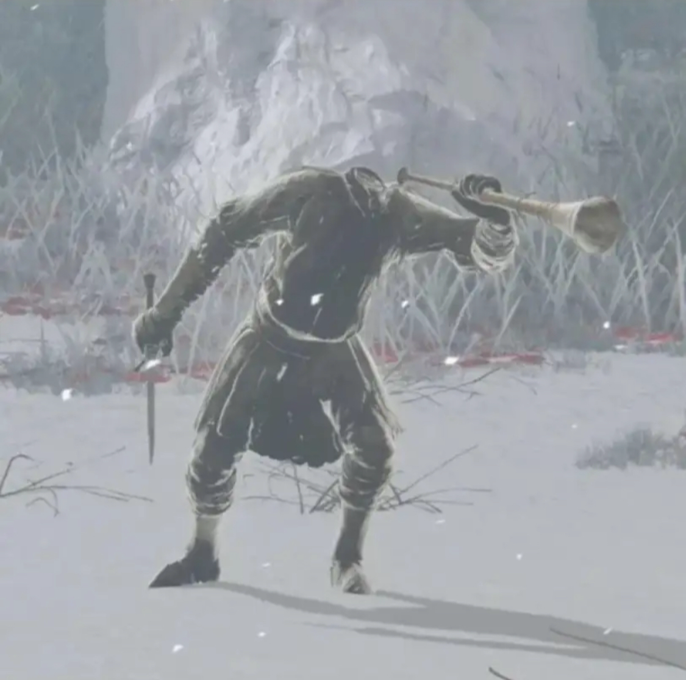

## Muy Buenas 👋

I'm a serious cat, here to do serious business 

### Experience: 
- Once saw a rat outside
- Been to mercadona
- Cooked lasagna without burning it

### Assets:
- Empty tuna can
- Ikea furniture
- Signed copy of monsters inc scare island instruction manual

## Notable Achievements 🎉

Opened tuna can within 10 minute deadline

Saved the president of Ecuador from rogue shoe

Successfully closed vim

how earth do i move past this image

⠀ <!-- blank space char -->

### Further guff

favourite nando's order: houmous with peri peri drizzle, extra hot grilled chicken wrap with chips, diet coke

### languages (wip lul)

<!--
**CorvoQueso/CorvoQueso** is a ✨ _special_ ✨ repository because its `README.md` (this file) appears on your GitHub profile.

Here are some ideas to get you started:

- 🔭 I’m currently working on ...
- 🌱 I’m currently learning ...
- 👯 I’m looking to collaborate on ...
- 🤔 I’m looking for help with ...
- 💬 Ask me about ...
- 📫 How to reach me: ...
- 😄 Pronouns: ...
- ⚡ Fun fact: ...
-->
